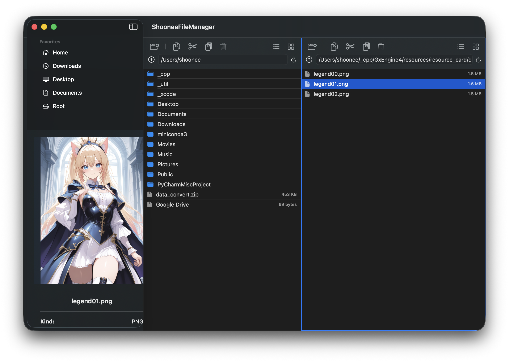

# ShooneeFileManager

A dual-pane file manager for macOS built with SwiftUI and AppKit.

## Overview

ShooneeFileManager is a lightweight Finder-style file manager with a two-pane workflow.
It focuses on fast navigation, keyboard-driven file operations, and a built-in preview area.

## Features

- Dual-pane layout for moving and comparing files side by side
- Favorites sidebar with quick access to `Home`, `Downloads`, `Desktop`, `Documents`, and `Root`
- File preview panel with thumbnail and metadata
- Copy, cut, paste, move to trash, and create folder actions
- Drag and drop between panes
- Keyboard shortcuts for common actions

## Built With

- Swift
- SwiftUI
- AppKit
- Quick Look Thumbnailing

## Running Locally

1. Open `ShooneeFileManager.xcodeproj` in Xcode.
2. Build and run the `ShooneeFileManager` target.
3. If macOS asks for file access, grant the required permissions.

## Permissions

Because this app works with user files and protected folders on macOS, file access behavior depends on system privacy settings.
For the best experience, you may need to allow access to folders such as `Desktop` and `Documents`, or grant Full Disk Access during testing.

## Current Status

This project is actively being improved.
The core dual-pane workflow is in place, and file operations are working, but there are still areas being refined, especially around macOS drag-and-drop behavior and permission handling.

## Screenshot

The repository includes the main app screenshot here:

- [`screenshot.png`](/Users/shoonee/_xcode/2603_filemanager/ShooneeFileManager/screenshot.png)
